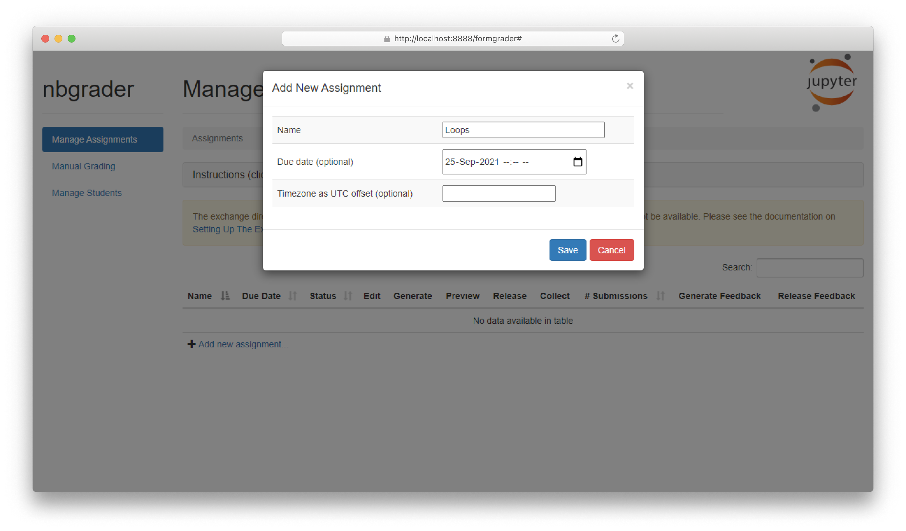
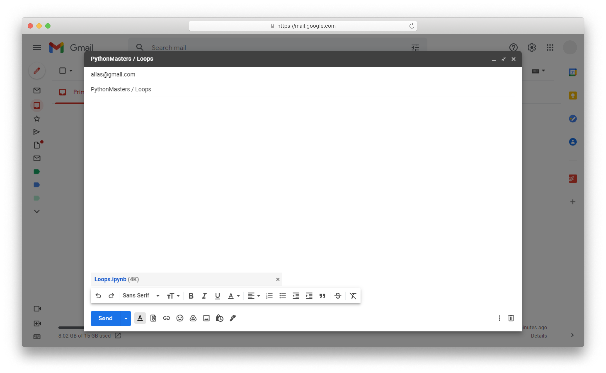
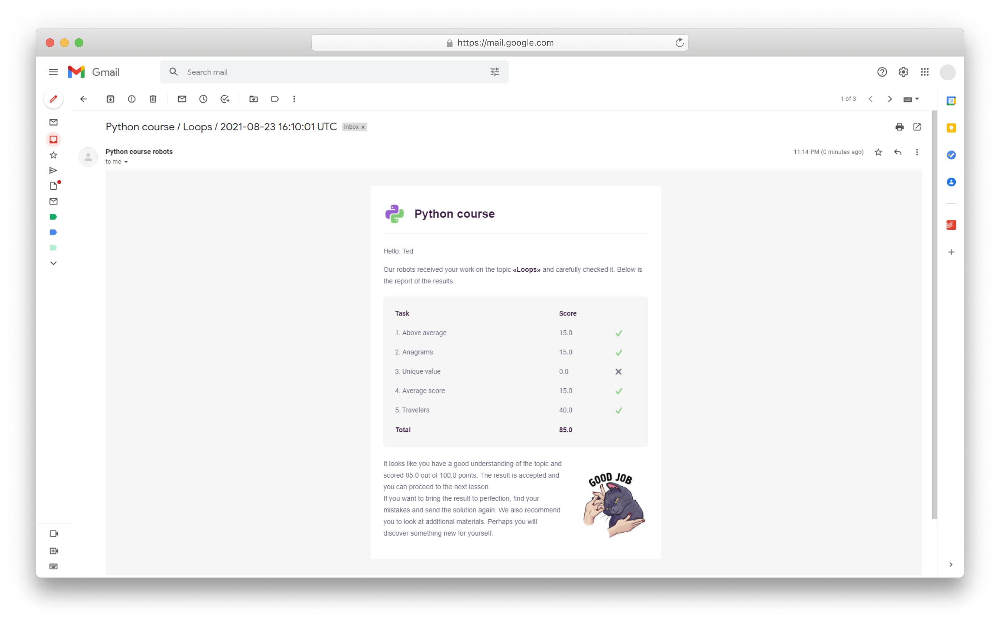
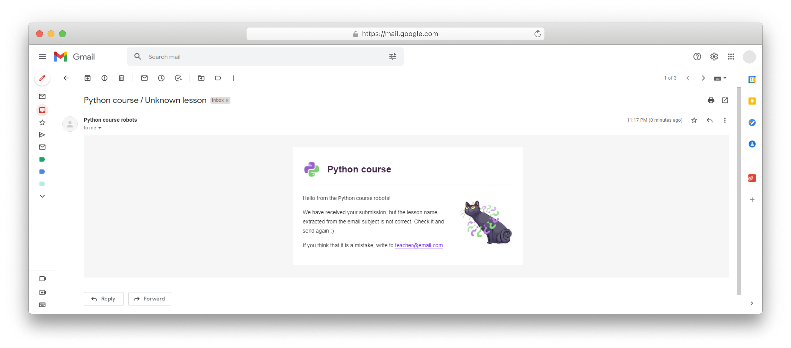

# Grading system for Python course

This is a system for assigning and automatic grading of Jupyter notebooks.
Communication between students and the grading system is implemented via email.
To release assignments to
students, [Google Drive](https://www.google.com/intl/en-GB/drive/) is used.

A short explanation of the grader work:

1. Teacher sets up the course backend: downloads the source code, adds lessons
   and publishes them for students.
   
2. Student downloads an assignment from the Google Drive folder, solves it,
   composes an email message with the solution files attached, and sends it to
   the teacher.
   
3. The grading system parses email messages, grades them with tests prepared by
   the teacher  (hidden from students).
4. If the submission is correct, the feedback message with grades is sent to
   the student.
   

   If something is wrong with the submission, the error message is sent to the
   student.
   

## How to set up a course

### Step 1: Download source code

First, you should download the source code and rename `.env.template` file
to `.env`. How to specify environment variables in the `.env` file is written
below.

### Step 2: Specify course details

Set the name of the course (for example, "Python course") to `COURSE_NAME`
variable.

The value of `TEACHER_EMAIL` is used in feedbacks or in service messages which
are sent when the grading system fails.

### Step 3: Prepare exchanger

The exchanger is responsible for fetching new submissions and sending feedbacks
after grading. This implementation uses email communication via Gmail API.

To set it up:

1. Create a project [on the Google Cloud](https://cloud.google.com/).
2. Enable Gmail API, create an OAuth client account for desktop applications,
   and download its keys in json format.
   See [Gmail API docs](https://developers.google.com/gmail/api/quickstart/python)
   for details.
3. Insert the keys as a json string in the `.env` file under `GMAIL_CREDS`
   variable.
4. Set `GMAIL_FETCH_LABEL` (for example, `"Python course for masters"`). Each
   message with this label will be considered as a submission.
5. Create a Gmail filter. It can be created manually via Gmail client or
   automatically. In the latter case, it is necessary to
   set `GMAIL_FETCH_KEYWORD` and `GMAIL_FETCH_ALIAS`. All messages that are
   addressed to `GMAIL_FETCH_ALIAS` and contain `GMAIL_FETCH_KEYWORD` in the
   subject will be marked with `GMAIL_FETCH_LABEL`.
6. Set `GMAIL_SENDER_NAME` and `GMAIL_SENDER_EMAIL` to specify the "from" part
   of outgoing messages.

### Step 4: Prepare database

The grading system uses a database. It can be [MySQL](https://www.mysql.com/)
, [PostgreSQL](https://www.postgresql.org/), or any other database that is
supported by [SQLAlchemy](https://www.sqlalchemy.org/).

You must set `DB_DRIVER`, `DB_HOST`, and `DB_PORT` for database connection. It
is considered that `DB_NAME` is used to store the course data,
and `DB_GRADER_USER` with `DB_GRADER_PASSWORD` has superuser permissions for
the database specified by the `DB_NAME` variable. `DB_ROOT_PASSWORD` is used
only when the database is created in a docker container.

The `DB_NAME` database must be previously created. However, all the necessary
tables will be created and populated automatically.

### Step 5: Specify service parameters

When the grading system fails, it is necessary to notify the teacher. In this
case, a service email with exception traceback is sent to the `TEACHER_EMAIL`
via SMTP server. So, the parameters `SERVICE_EMAIL_LOGIN`
, `SERVICE_EMAIL_PASSWORD` must be specified to connect to the SMTP
server `SERVICE_EMAIL_SERVER` via `SERVICE_EMAIL_PORT` port.

### Step 6: Install dependencies

All the necessary dependencies are listed in `requirements.txt`. So, you should
install Python 3.9 (or newer) on your system, create a virtual environment, and
install packages as usual:

```shell
pip install -r requirements.txt
```

To enable the necessary extensions in Jupyter, run this in the terminal:

```shell
jupyter nbextension install --sys-prefix --py nbgrader --overwrite
jupyter nbextension enable --sys-prefix --py nbgrader
jupyter serverextension enable --sys-prefix --py nbgrader
```

### Step 7: Add lessons

The grading system
uses [nbgrader](https://github.com/jupyter/nbgrader/tree/8a498b320b8a91f83edaa1ab9aa5c280c976c572)
tool under the hood. Thus, details of assignments creating, description of the
folder structure, and content of the `nbgrader_config.py` file can be
found [in its docs](https://nbgrader.readthedocs.io/en/stable/).

To add an assignment, you should launch Jupyter from the project root, move
to `Formgrader` page and click on `Add new assignment`. Use can
use `add_lesson.py` script to do the same.

Open the assignment source folder, add a notebook and necessary files. Note
that the name of the notebook must match the assignment name.

The notebook should contain tasks for students. Each task must consist of the
following cells:

1. One read-only markdown cell with the text of pattern `TODO: <Task name>`.
   These task names will be automatically parsed for feedbacks. The pattern of
   task names can be changed in `definitions.py`.
2. One or several cells with `### BEGIN SOLUTION` and `### END SOLUTION`
   comments where the solution should be written. Mark these cells
   as `Autograded answer`.
   See, [nbgrader docs](https://nbgrader.readthedocs.io/en/stable/user_guide/creating_and_grading_assignments.html)
   for more details.
3. One cell with `### BEGIN HIDDEN TESTS` and `### END HIDDEN TESTS` comments
   for tests. Mark these cells as `Autograded tests`.
   See, [nbgrader docs](https://nbgrader.readthedocs.io/en/stable/user_guide/creating_and_grading_assignments.html)
   for more details. Specify max score for each test cell. The sum score of the
   assignment should be equal to 100.

Lesson template can be found [here](demo/lesson.ipynb).

After lesson content is prepared, click `Generate` in the `Formgrader` page of
Jupyter to create a release version of the lesson. Now, you can see how your
assignment will look to students.

### Step 8: Add users

To add a user, you can launch Jupyter from the project root, move
to `Formgrader`, next to `Manage Students`, and click on `Add new student`.
Next, specify all the fields `Student ID`, `First name`, `Last name`, `Email`.
The `Student ID` and `Email` must be unique and non-empty.

You can also use `add_user.py` script which automatically creates student ids,
validates emails, and makes other necessary checks.

### Step 9: Publish lessons

When you are ready to send assignments to students, you can
run `publish_lesson.py` script. This will generate student versions of the
lessons and upload them to Google Drive.

Before this, you must complete some preparations:

1. Enable Google Drive API for your project created
   at [Step 3](#step-3-prepare-exchanger), create a service account, and
   download its keys in json format.
   See [Google Drive API docs](https://developers.google.com/drive/api/v3/quickstart/python)
   for details.
2. Insert the keys as a json string in the `.env` file under `GDRIVE_CREDS`.
   Copy email of the service account.
3. Create a folder `GDRIVE_PUBLISH_FOLDER` in your Google Drive where you are
   going to store public version of assignments. Share this folder and grant "
   editor" permissions with the email from the previous step.

It's time to run `publish_lesson.py` script. This will create all necessary
folders in your Google Drive folder, share the folders with links, and upload
files. However, this will be made automatically when the grading system
starting.

Do not modify cloud release folders on your own. If you want to change
something, make this locally and run the release script again. Shared folders
and their links will stay the same, however, their content will be changed.

### Step 10: Start grading

To start the grading process, run `main.py` from the project root.

Student should download assignments from the Google Drive release folder,
insert solutions and send files as attachments to `GMAIL_FETCH_ALIAS`. It is
considered that each message with a submission has a subject of the
structure "`GMAIL_FETCH_KEYWORD` / `lesson name`". In several minutes, the
corresponding feedback will be sent to the student.

Progress of students can be found in `Formgrader` page of Jupyter.
